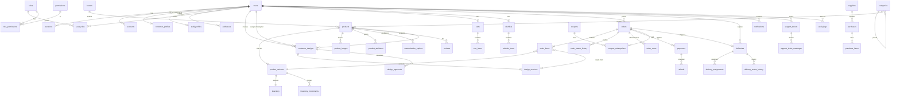

# Entity Relationship Diagram

Core relationships only (52 tables in total; see [DATABASE.md](DATABASE.md)). Renders on GitHub.

```mermaid
erDiagram
  users ||--o{ sessions : has
  users ||--o{ accounts : has
  users ||--o| customer_profiles : "is customer"
  users ||--o| staff_profiles : "is staff"
  users ||--o{ addresses : owns
  users ||--o{ user_roles : holds
  roles ||--o{ user_roles : grants
  roles ||--o{ role_permissions : has
  permissions ||--o{ role_permissions : in

  categories ||--o{ categories : parent
  categories ||--o{ products : contains
  brands ||--o{ products : makes
  products ||--|{ product_variants : "sold as"
  products ||--o{ product_images : shows
  products ||--o{ product_attributes : specs
  products ||--o{ customization_options : configures
  products ||--o{ reviews : receives
  product_variants ||--|| inventory : stocked
  product_variants ||--o{ inventory_movements : ledger
  suppliers ||--o{ purchases : supplies
  purchases ||--|{ purchase_items : lines

  users ||--o{ customer_designs : creates
  products ||--o{ customer_designs : for
  customer_designs ||--|{ design_versions : versions
  customer_designs ||--o{ design_approvals : decisions
  users ||--o{ customer_designs : "assigned designer"

  users ||--o| carts : has
  carts ||--o{ cart_items : contains
  users ||--o| wishlists : has
  wishlists ||--o{ wishlist_items : contains

  users ||--o{ orders : places
  orders ||--|{ order_items : contains
  order_items }o--|| product_variants : of
  order_items }o--o| design_versions : "made from"
  orders ||--o{ order_status_history : history
  orders ||--o{ order_notes : "internal notes"
  orders ||--o{ payments : paid
  payments ||--o{ refunds : refunded
  coupons ||--o{ coupon_redemptions : used
  orders ||--o| coupon_redemptions : applies

  orders ||--o| deliveries : shipped
  deliveries ||--o{ delivery_assignments : assigned
  deliveries ||--o{ delivery_status_history : history
  users ||--o{ deliveries : "captain"

  users ||--o{ notifications : receives
  users ||--o{ support_tickets : opens
  support_tickets ||--o{ support_ticket_messages : thread
  users ||--o{ audit_logs : "actor of"
```
